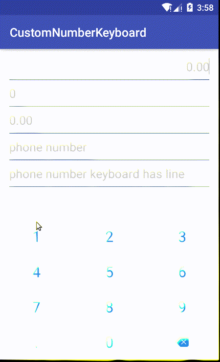
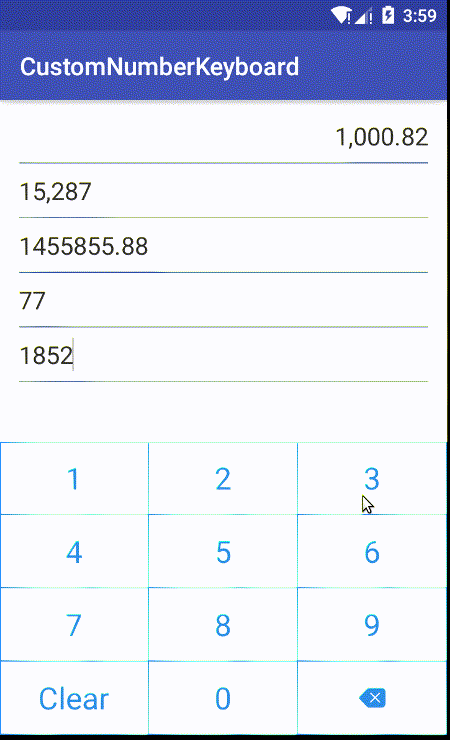

CustomNumberKeyboard
======================

A custom keyboard of android that can input number or decimals, currency etc.

Please feel free to use this.

# Features

* Curreny input and format.
* Number input.
* Decimals input.
* Phone number input.
* Custom rules.


# Demo

### Use Input
 


# How do I use it?

## Setup

#### Gradle

```groovy
dependencies {
  // jCenter
  compile 'com.carlos.widget:numberkeyboard:0.1.+'
}
```

## Keyboard config    
### step1
```
	<com.carlos.number.keyboard.KeyBoardLayout
		android:id="@+id/keyboard_layout"
		android:layout_width="match_parent"
		android:layout_height="wrap_content"
		android:layout_alignParentBottom="true"
		android:overScrollMode="never"
		android:scrollbars="none"
		app:key_board_clear_text="Clear"
		app:key_board_del_res="@drawable/icon_numeric_keyboard_blue_delete"
		app:key_board_type="number_with_decimals"
		app:key_item_background="@drawable/keyboard_item_normal_clicked_bg"
		app:key_text_color="@color/primaryBlue"
		app:key_text_size="25dp"
		app:key_board_line_res="@drawable/keyboard_line"/>
```
        
there also have some other attrs that can config the keyboard style.
	
### setp2
```
		// watch keyboard text input.
		mKeyBoardLayout.addKeyBoardCallback(mCurrencyTwoDecimalDigitsView);
		mKeyBoardLayout.addKeyBoardCallback(mCurrencyNoneDecimalDigitsView);
		mKeyBoardLayout.addKeyBoardCallback(mNumberDecimalEditText);
		mKeyBoardLayout.addKeyBoardCallback(mPhoneNumberEditText);
		mKeyBoardLayout.addKeyBoardCallback(mPhoneNumberLineEditText);
		// if need line
		mKeyBoardLayout.setDrawLine(false);
		// show the keyboard.
		mKeyBoardLayout.showKeyBoard();
```
by the way, we can set different type to dynamic show the keyboad.

## NumberEdit input
```
      <com.carlos.number.keyboard.NumberDecimalEditText
          android:id="@+id/et_phone_number_line"
          android:layout_width="match_parent"
          android:layout_height="wrap_content"
          android:background="@null"
          android:gravity="left|center_vertical"
          android:hint="phone number keyboard has line"
          android:inputType="number"
          android:maxLines="1"
          android:textColor="#333333"
          android:textColorHint="#cccccc"
          android:textCursorDrawable="@null"
          android:textSize="20sp"
          app:decimal_digits="0"
          app:max_input_integers="11"/>
```
decimal_digits and max_input_integers are used to config the input limits.we also can set it by the code, it's dynamic we can change the limits anytime by using code.


License
-------

    Copyright 2017 Wasabeef

    Licensed under the Apache License, Version 2.0 (the "License");
    you may not use this file except in compliance with the License.
    You may obtain a copy of the License at

       http://www.apache.org/licenses/LICENSE-2.0 

    Unless required by applicable law or agreed to in writing, software
    distributed under the License is distributed on an "AS IS" BASIS,
    WITHOUT WARRANTIES OR CONDITIONS OF ANY KIND, either express or implied.
    See the License for the specific language governing permissions and
    limitations under the License.